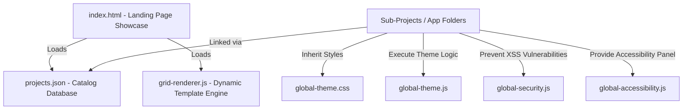

# Repository Architecture & Technical Design

This document details the system architecture, design patterns, file structure, and technical requirements for the **student-notes-app** project.

---

## 🏗 System Overview

The repository acts as a centralized dashboard and gallery showcase for multi-disciplinary student-targeted micro-applications. It provides shared resources (styling systems, security controllers, accessibility widgets, and event telemetry helpers) that sub-projects import to ensure visual consistency and code reliability.



---

## 📂 Core Folder Hierarchy

```text
student-notes-app/
│
├── .github/                       # GitHub Actions workflows & PR/Issue templates
├── docs/                          # Developer documentation and specifications
│   ├── ARCHITECTURE.md            # System Architecture and Onboarding Guide
│   └── INTEGRATION_GUIDE.md       # Integration instructions for global utilities
│
├── global-theme.css               # Centralized light/dark variable tokens
├── global-theme.js                # Core state theme synchronization script
├── global-security.js             # Shared secure input/HTML sanitizers
├── global-accessibility.js        # Global floating A11y controller
├── global-accessibility.css       # Contrast modes and layout reflow properties
│
├── projects.json                  # Showcased projects database metadata
├── grid-renderer.js               # Dynamically mounts items from projects.json
│
├── [project-name]/                # Isolated sandbox folder for individual projects
│   ├── index.html                 # Entrypoint
│   ├── style.css                  # Local stylesheets using CSS variable tokens
│   └── script.js                  # Application logic
```

---

## 🚀 Shared Component Integrations

All sandboxed sub-applications are strongly encouraged to integrate the shared utilities directly from the root workspace folder:

### 1. Unified Theme Management
```html
<!-- In head of your local index.html -->
<link rel="stylesheet" href="../global-theme.css">
<!-- Before closing body tag -->
<script src="../global-theme.js"></script>
```

### 2. Client-side Input Sanitization (XSS Mitigation)
```html
<script src="../global-security.js"></script>
<script>
  const safeText = Security.escapeHTML(userInput);
</script>
```

### 3. Accessible User Panel
```html
<link rel="stylesheet" href="../global-accessibility.css">
<script src="../global-accessibility.js"></script>
```
